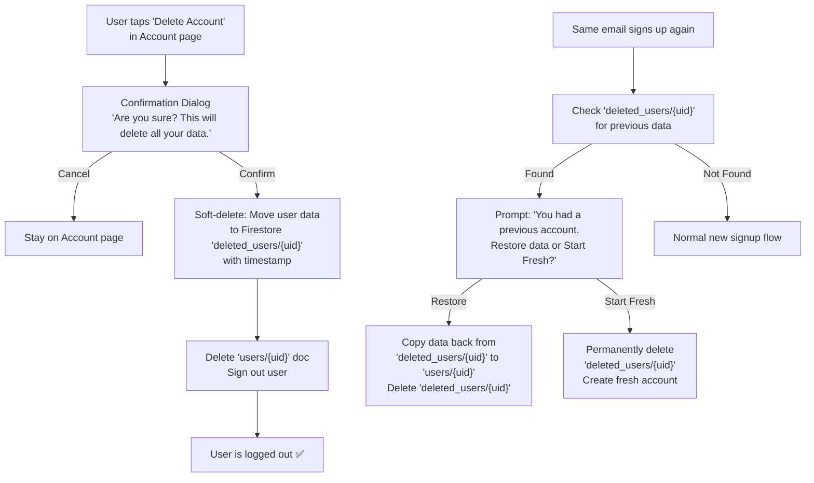
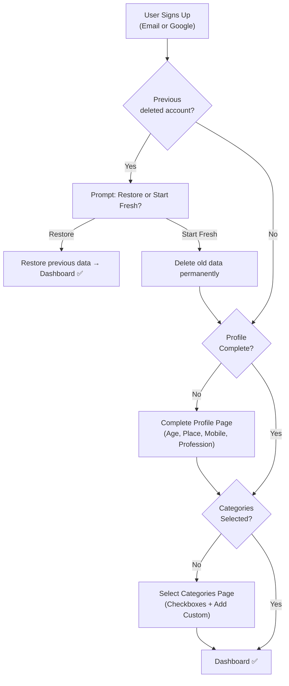

# Profession Options Update, Category Onboarding & Delete Account

## Goal
1. Update profession choices — remove "Freelancer", add "Home Maker/Housewife"
2. Add a Todoist-style category selection screen after signup — users pick which income/expense categories they want + can add custom ones before reaching the dashboard
3. Add "Delete Account" option that wipes user data, with re-signup recovery prompt

---

## Proposed Changes

### 1. Profession Options Update

#### [MODIFY] [Signup.jsx](file:///c:/Users/Suresh/Documents/Antigravity/4.Budget%20tracker/src/pages/auth/Signup.jsx)
```diff
-const professionOptions = ["Business", "Working Professional", "Freelancer", "Student"];
+const professionOptions = ["Business", "Working Professional", "Student", "Home Maker/Housewife"];
```

#### [MODIFY] [CompleteProfile.jsx](file:///c:/Users/Suresh/Documents/Antigravity/4.Budget%20tracker/src/pages/auth/CompleteProfile.jsx)
Same change as above.

---

### 2. Category Onboarding Screen

#### Profession-Specific Suggested Categories

Each profession gets relevant pre-checked categories. Users can check/uncheck as needed:

| Profession | Income Categories | Expense Categories | Savings | Debt |
|:---|:---|:---|:---|:---|
| **Business** | Business Revenue, Investments, Consulting | Office Rent, Marketing, Travel, Food, Supplies, Utilities | Emergency Fund | Credit Card |
| **Working Professional** | Salary, Bonus, Side Income | Food, Transport, Rent/EMI, Utilities, Entertainment, Clothes, Coffee | Emergency Fund | Credit Card |
| **Student** | Pocket Money, Part-time Job, Scholarship | Food, Transport, Books/Stationery, Tuition, Entertainment, Coffee | Emergency Fund | — |
| **Home Maker/Housewife** | Household Budget, Savings Interest | Groceries, Utilities, Kids Education, Medical, Household Items, Beauty | Emergency Fund | Credit Card |

> [!NOTE]
> All suggested categories are pre-checked by default. Users can uncheck what they don't need **AND** add their own custom categories via an "Add Custom Category" button at the bottom of each section (Name + Icon + Color picker).

#### Household Invite Code Behavior

> [!IMPORTANT]
> **Each household member keeps their own independent categories.** When your wife signs up as "Home Maker/Housewife" and later enters a household invite code, she retains her housewife-specific categories. Household sharing only enables shared transaction visibility between members — it does NOT merge or override anyone's categories.

#### [NEW] [SelectCategories.jsx](file:///c:/Users/Suresh/Documents/Antigravity/4.Budget%20tracker/src/pages/auth/SelectCategories.jsx)

New onboarding page shown after profile completion but before dashboard access:
- Reads the user's `profession` from their profile
- Shows profession-specific suggested categories grouped by type (Income / Expense / Savings / Debt)
- Each category rendered as a checkbox card with icon + name + color indicator
- All pre-checked by default
- **"+ Add Custom Category"** button in each section — opens inline form with Name, Icon picker, Color picker
- "Continue to Dashboard" button at bottom
- On submit: saves selected + custom categories to Firestore and sets `categoriesSelected: true`

#### [MODIFY] [FinanceContext.jsx](file:///c:/Users/Suresh/Documents/Antigravity/4.Budget%20tracker/src/context/FinanceContext.jsx)

- Add `SUGGESTED_CATEGORIES` constant organized by profession
- Add `categoriesSelected: false` to `DEFAULT_STATE.profile`
- Add `saveCategorySelection(selectedCategories)` function
- Grandfather existing users: if `categoriesSelected === undefined`, auto-set to `true`
- New users start with empty categories until they complete the selection screen

#### [MODIFY] [ProtectedRoute.jsx](file:///c:/Users/Suresh/Documents/Antigravity/4.Budget%20tracker/src/components/ProtectedRoute.jsx)

Add second onboarding gate:
- After `profileComplete` check passes, also check `profile.categoriesSelected`
- If falsy, redirect to `/select-categories`

#### [MODIFY] [App.jsx](file:///c:/Users/Suresh/Documents/Antigravity/4.Budget%20tracker/src/App.jsx)

Add new route for `/select-categories`.

---

### 3. Delete Account Feature

#### How It Works



> [!IMPORTANT]
> User data is **soft-deleted first** (moved to `deleted_users/{uid}` collection with a timestamp). This allows the recovery prompt if they sign up again. If they choose "Start Fresh", the soft-deleted data is permanently wiped.

#### [MODIFY] [Account.jsx](file:///c:/Users/Suresh/Documents/Antigravity/4.Budget%20tracker/src/pages/Account.jsx)

- Add "Delete Account" button at the bottom of the Account page (red, with warning styling)
- Show confirmation modal with "This will delete all your data. Are you sure?"
- On confirm: call `deleteAccount()` from FinanceContext

#### [MODIFY] [FinanceContext.jsx](file:///c:/Users/Suresh/Documents/Antigravity/4.Budget%20tracker/src/context/FinanceContext.jsx)

- Add `deleteAccount()` function:
  1. Copy current `users/{uid}` doc to `deleted_users/{uid}` with `deletedAt` timestamp
  2. Delete `users/{uid}` doc
  3. Sign out user

- Add `checkDeletedAccount(uid)` function:
  1. Check if `deleted_users/{uid}` exists
  2. If yes, return the deleted data for the recovery prompt

#### [MODIFY] [AuthContext.jsx](file:///c:/Users/Suresh/Documents/Antigravity/4.Budget%20tracker/src/context/AuthContext.jsx)

- After successful signup/Google login, call `checkDeletedAccount(uid)`
- If previous data found, show recovery prompt before proceeding to onboarding

---

## Complete User Flow



---

## Verification Plan

### Build Test
- Run `pnpm run build` to confirm 0 compilation errors

### Manual Testing
1. New signup → Complete Profile → Select Categories → Dashboard flow
2. Existing users NOT blocked (grandfathered)
3. Each profession shows correct suggested categories
4. Custom category add works on onboarding screen
5. Delete Account → re-signup → recovery prompt works
6. "Start Fresh" permanently deletes old data

### Git & APK
- Commit and push to GitHub `main`
- Rebuild `BudgetTracker.apk`
